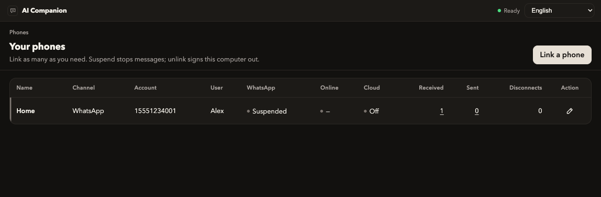
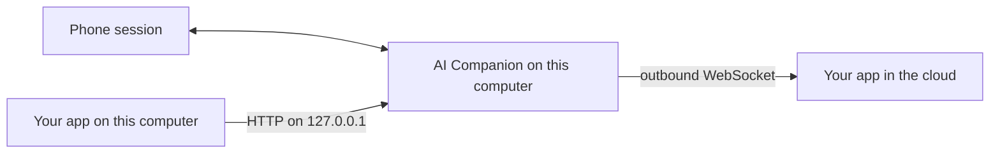
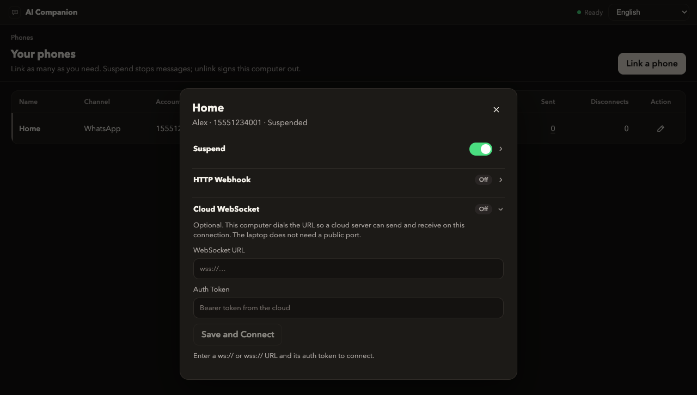
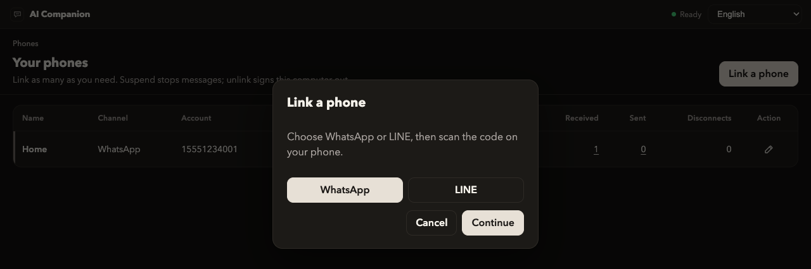
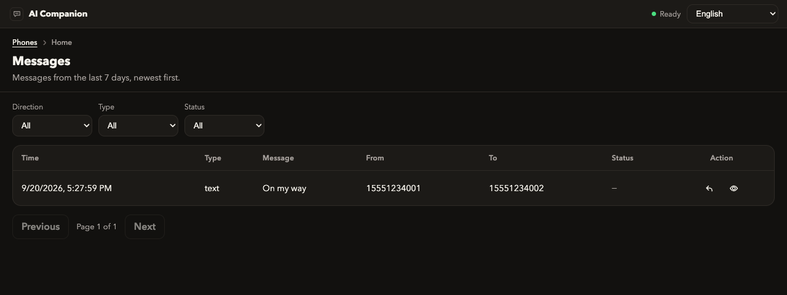
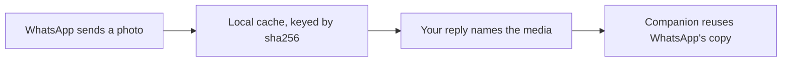

# AI Companion

A prebuilt gateway for personal WhatsApp and LINE. Install it, link a phone once, and your app sends and receives messages. Companion takes care of the phone session, the reconnects, and the protocol exchange.

Your app talks to Companion over HTTP on this computer, or Companion connects to your WebSocket server and holds the connection. The phone protocol stays inside the gateway.

[](LICENSE)
[](https://github.com/tinyeeliu/ai-companion/releases)



*Names and numbers in these screenshots are samples.*

## Use it with your app

Link the phone in the Companion window. After that, your app only deals with messages.

**Your app runs on the same computer.** Call `http://127.0.0.1:38888`. Send a text, list history, check that the phone is linked. The WhatsApp and LINE sockets stay inside Companion.

**Your app runs somewhere else.** Give Companion your server's WebSocket URL. Companion dials out and keeps the socket open, so the laptop never accepts an inbound connection. Your server receives events and asks Companion to send.




A webhook is the smaller option when you only need new messages pushed to an HTTPS URL. The WebSocket is the one to use when your server also sends.



## Install

Download a build from [Releases](https://github.com/tinyeeliu/ai-companion/releases) and run that. Compiling is optional and off the normal path.


| Platform              | File                                |
| --------------------- | ----------------------------------- |
| macOS (Apple Silicon) | `AICompanion-macos-aarch64.dmg`     |
| Windows (x64)         | `AICompanion-windows-x64-setup.exe` |


The installers are unsigned, so the operating system warns once.

**macOS.** Drag AI Companion into Applications. Then System Settings → Privacy & Security → **Open Anyway**, or:

```bash
xattr -dr com.apple.quarantine /Applications/AICompanion.app
```

Right-click → Open does not bypass this on macOS 15 or later.

**Windows.** If SmartScreen shows "Windows protected your PC", choose **More info** → **Run anyway**.

Leave the app running. It can start at login. Closing the window hides it to the tray. **Quit** is what stops the phone sessions.

## Link a phone

Choose **Link a phone**, pick WhatsApp or LINE, and scan.



**WhatsApp.** On the phone: Settings → Linked devices → Link a device.

**LINE.** Scan in the LINE app, then enter the PIN shown on the computer.

Link as many accounts as you need. Each one is a separate connection your app can address. Suspend pauses traffic and leaves the phone signed in.

The received and sent counts open the last 7 days. Your app can read the same history over HTTP.



## What you can count on

Companion is the piece that stays up. Your app can restart, deploy, or lose the network without owning the phone session.

- Linked phones come back when the app starts. You scan again only after an unlink or a logout.
- A send is stored before it is transmitted. If the phone is offline, or your cloud socket is down, the message waits and goes out in order when the path is back.
- The cloud socket reconnects on its own after a network drop. A rejected token stops, so a bad credential does not retry forever.
- The API binds to this computer only. Phone credentials stay in the app's data folder.

## Call it from your app

Health needs no token. Every other call uses the Bearer token from that response.

```bash
curl -s http://127.0.0.1:38888/api/v1/im/health
```

```json
{"ok":true,"port":38888,"token":"…"}
```

The same value is in `config.json` if you would rather read a file:


| Where   | Path                                                                     |
| ------- | ------------------------------------------------------------------------ |
| macOS   | `~/Library/Application Support/app.aicompanion.desktop/data/config.json` |
| Windows | `%APPDATA%\app.aicompanion.desktop\data\config.json`                     |


```bash
export TOKEN=paste-the-token
export BASE=http://127.0.0.1:38888/api/v1/im
```

See linked phones:

```bash
curl -s "$BASE/connection" -H "Authorization: Bearer $TOKEN"
```

Send a text. The call returns when the message is queued, not when the phone has delivered it. WhatsApp `to` is digits with the country code. LINE `to` is a user id (`u…`).

```bash
curl -s "$BASE/connection/CONNECTION_ID/message" \
  -H "Authorization: Bearer $TOKEN" \
  -H "Content-Type: application/json" \
  -d '{"to":"15551234001","text":"On my way"}'
```

```json
{"id":"…","to":"15551234001","status":"pending"}
```

Push each new message to your HTTPS server. Companion calls that URL with the token as `Authorization: Bearer`:

```bash
curl -s -X PUT "$BASE/connection/CONNECTION_ID/webhook" \
  -H "Authorization: Bearer $TOKEN" \
  -H "Content-Type: application/json" \
  -d '{"url":"https://example.com/hooks/inbound","token":"example-token"}'
```

```json
{"connectionId":"home","channel":"whatsapp","id":"…","from":"15551234001","to":"15551234002","text":"On my way","timestamp":0,"type":"text"}
```

Or have Companion dial your server. One URL and one token per phone:

```bash
curl -s -X PUT "$BASE/connection/CONNECTION_ID/cloud" \
  -H "Authorization: Bearer $TOKEN" \
  -H "Content-Type: application/json" \
  -d '{"url":"wss://example.com/v1/companion","token":"example-token"}'
```

Your server accepts the WebSocket, checks the Bearer token, and answers `hello`. Events come in. Sends go back out on the same socket. Clear either setting with `{"url":null}`.

The webhook body above is a short summary Companion builds for you. The cloud socket is different: `data` is the object from [Baileys](https://github.com/WhiskeySockets/Baileys) or [LINEJS](https://jsr.io/@evex/linejs), unchanged. The next section is that exchange.

Route details are in [spec/doc/Architecture.md](spec/doc/Architecture.md). Frame rules and close codes are in [spec/doc/CloudServer.md](spec/doc/CloudServer.md).

## WhatsApp and LINE

Companion is a linked device on the phone's account. [Baileys](https://github.com/WhiskeySockets/Baileys) is the WhatsApp Web library. [LINEJS](https://jsr.io/@evex/linejs) is the LINE library. Both speak the personal-account protocol. Companion holds the socket, the keys, and the reconnects. Your server never imports either library. It reads and writes the JSON those libraries already use.

On the cloud socket every frame is a JSON text message. The envelope is the same for both apps. The library object sits in `data`.

```json
{
  "v": 1,
  "type": "event",
  "connectionId": "home",
  "channel": "whatsapp",
  "name": "messages.upsert",
  "data": {}
}
```

`channel` is `whatsapp` or `line`. `name` is the library event or the method you are calling. `userId`, when present, is the channel address of the one person the frame is about (a WhatsApp phone number, or a LINE user id). Bytes inside `data` are `{ "$bin": "<base64>" }` instead of raw binary.

An app on the same computer can read the same library object without a WebSocket: `GET /api/v1/im/connection/:id/messages/:messageId` returns it as `rawIn`.

### WhatsApp (Baileys)

Baileys connects as WhatsApp Web. Scanning the QR in Companion is "Link a device" on the phone. After that, Baileys keeps a multi-device session in the app's data folder and restores it on launch.

Companion forwards two Baileys events:

| `name` | What `data` is |
|---|---|
| `messages.upsert` | A new message, in Baileys' upsert shape |
| `connection.update` | The socket moving between QR, open, and close |

A text from the phone arrives as one message inside `messages`, with `type` set to `notify`. Ordinary text is the `conversation` field. A reply, link preview, or longer text is `extendedTextMessage.text`. Photos, video, audio, documents, and stickers use their own `*Message` object (`imageMessage`, and so on) on the same `message` field. Companion stores and forwards that object. It does not convert it into a private schema.

```json
{
  "v": 1,
  "type": "event",
  "connectionId": "home",
  "channel": "whatsapp",
  "userId": "15551234002",
  "name": "messages.upsert",
  "data": {
    "type": "notify",
    "messages": [
      {
        "key": {
          "remoteJid": "15551234002@s.whatsapp.net",
          "fromMe": false,
          "id": "3EB0ABC"
        },
        "messageTimestamp": 1750000000,
        "message": { "conversation": "On my way" }
      }
    ]
  }
}
```

Real upserts carry more fields than this. Treat `key.id` as the vendor message id and use it to ignore duplicates. Companion already skips its own sends (`fromMe`) and status broadcasts before this frame is queued.

To send, call Baileys' `sendMessage`. The arguments are the ones that method takes: a JID, then the content object. Text content is `{ "text": "…" }`. An image Baileys can upload for you is `{ "image": { "url": "https://…" }, "caption": "…" }`.

```json
{
  "v": 1,
  "type": "invoke",
  "id": "send-1",
  "connectionId": "home",
  "channel": "whatsapp",
  "name": "sendMessage",
  "data": {
    "args": [
      "15551234002@s.whatsapp.net",
      { "text": "On my way" }
    ]
  }
}
```

Companion writes the send to disk and answers immediately. The `result` is a queue receipt. `key.id` here is Companion's id, not WhatsApp's id, and it does not mean the phone has delivered the message yet.

```json
{
  "v": 1,
  "type": "result",
  "id": "send-1",
  "connectionId": "home",
  "channel": "whatsapp",
  "name": "sendMessage",
  "data": {
    "key": {
      "id": "0197…",
      "remoteJid": "15551234002@s.whatsapp.net"
    }
  }
}
```

Four other Baileys methods are allowed, and they run immediately rather than through the queue: `relayMessage`, `readMessages`, `sendPresenceUpdate`, and `prepareMedia`. `prepareMedia` uploads media to WhatsApp and hands you the result, which is how an interactive message with an image header, or a media carousel card, gets built — only the process holding the socket can upload. Anything else comes back as `METHOD_NOT_ALLOWED`.

The local `POST /message` with `{ "to", "text" }` is the same send, written for a dashboard or a script. Companion turns that into `sendMessage` for you. Use `invoke` when your server already speaks Baileys' arguments.

### Group chats

Group messages arrive like one-to-one messages. `key.remoteJid` is the group JID, which ends in `@g.us`, and the sender is `key.participant`. Under WhatsApp's newer privacy addressing the phone number sits on `key.participantAlt` instead, and Companion prefers it, so `userId` stays a phone number either way.

To send to a group, address the group. The local `POST /message` keeps a `to` that already carries an `@` as it is, rather than reducing it to a phone number:

```bash
curl -s "$BASE/connection/CONNECTION_ID/message" \
  -H "Authorization: Bearer $TOKEN" \
  -H "Content-Type: application/json" \
  -d '{"to":"120363412973586464@g.us","text":"See you at six"}'
```

The `sendMessage` invoke takes the same value as its first argument.

### LINE (LINEJS)

LINEJS logs in as a second device on a personal LINE account (`ANDROIDSECONDARY`). The QR and the PIN in Companion are that login. The auth token and the end-to-end keys stay in the app's data folder. This is the protocol the LINE app uses, not the LINE Official Account API.

Companion forwards one LINEJS event. `name` is `message`. `data` is the talk message LINEJS emitted. The LINE struct itself is `data.raw`: sender, recipient, id, text, and `contentType`. `contentType` `"NONE"` is a normal text. `"IMAGE"`, `"VIDEO"`, `"AUDIO"`, `"STICKER"`, `"FILE"`, and the other LINE types arrive the same way, with their metadata still on `raw`.

```json
{
  "v": 1,
  "type": "event",
  "connectionId": "home",
  "channel": "line",
  "userId": "u11111111111111111111111111111111",
  "name": "message",
  "data": {
    "isTalk": true,
    "isSquare": false,
    "raw": {
      "id": "12345",
      "from": "u11111111111111111111111111111111",
      "to": "u99999999999999999999999999999999",
      "text": "On my way",
      "contentType": "NONE",
      "createdTime": "1750000000000"
    }
  }
}
```

`userId` is the sender's LINE mid, the same value as `raw.from`. Companion listens to 1:1 and group talk, and it does not forward LINE Square.

To send text, call LINEJS `sendCompactMessage`. The arguments are the recipient mid, then the string.

```json
{
  "v": 1,
  "type": "invoke",
  "id": "send-2",
  "connectionId": "home",
  "channel": "line",
  "name": "sendCompactMessage",
  "data": {
    "args": ["u11111111111111111111111111111111", "On my way"]
  }
}
```

The queued ack is LINEJS' id field, filled with Companion's id until LINE accepts the send:

```json
{
  "v": 1,
  "type": "result",
  "id": "send-2",
  "connectionId": "home",
  "channel": "line",
  "name": "sendCompactMessage",
  "data": { "messageId": "0197…" }
}
```

`sendCompactMessage` is the only LINE method on the socket. A text send from `POST /message` calls that same method. The `to` value is the mid, and Companion does not strip characters from it.

## Media

Photos, video, audio, and documents a user sends are decrypted once and kept on this computer. Each one is named by the SHA-256 of its plaintext, so the same file is one entry however many times it arrives.



That is what makes a repeat cheap. Name the media by its digest and Companion reuses the copy WhatsApp already holds, so the same picture goes out again with no download and no upload. It is the ordinary `sendMessage` content, with the digest beside the url:

```json
{
  "v": 1,
  "type": "invoke",
  "id": "send-3",
  "connectionId": "home",
  "channel": "whatsapp",
  "name": "sendMessage",
  "data": {
    "args": [
      "15551234002@s.whatsapp.net",
      {
        "image": { "url": "https://storage.example.com/temp/…jpeg", "sha256": "…" },
        "caption": "Here it is"
      }
    ]
  }
}
```

The digest is base64url without padding. When Companion has that content it reuses the WhatsApp copy; when it does not, it fetches the url once and keeps the result. Either way you never ship the bytes yourself.

Two things to know. WhatsApp serves a media blob for about a month and then collects it; that expiry is recorded next to the cached copy, so a reply after it re-uploads from the local file, which still costs you no download. And the cache is a regenerable copy under the app's data folder, so clearing it costs nothing but speed.

The `media` block on inbound events, the digest spellings, and the cache layout are in [spec/doc/Architecture.md](spec/doc/Architecture.md) and [spec/doc/CloudServer.md](spec/doc/CloudServer.md).

## Limits

- Another computer cannot call the API. The listener is `127.0.0.1`.
- WhatsApp is a linked-device session. LINE is a personal-account session. Companion is not affiliated with Meta or LY Corporation, and it does not use the WhatsApp Business Cloud API or the LINE Official Account API.
- Message rows are removed after 7 days. The received and sent counters on each phone stay.
- Cached media is kept for up to a year of disuse, and WhatsApp serves each blob for about a month. The cache is disposable — `data/media.sqlite` and `data/media/` sit beside `config.json`, and removing them never touches a queued message.
- Release builds are not notarized and not Authenticode-signed.

## License

[Apache License 2.0](LICENSE).

Source is in this repo if you want to read the contract or run an unpackaged build (`./scripts/run.sh`, API `:38000`, dashboard `:5178`). The app most people run is the [release](https://github.com/tinyeeliu/ai-companion/releases).