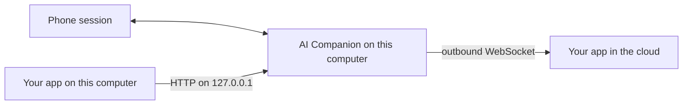

# AI Companion

A prebuilt gateway for personal WhatsApp and LINE. Install it, link a phone once, and your app sends and receives messages. Companion take cares of the phone session, the reconnects, and the protocol exchange.

Your app talks to Companion over HTTP on this computer, or Companion connect to your websocker server and holds the connection. The phone protocol stays inside the gateway.


*Names and numbers in these screenshots are samples.*

## Use it with your app

Link the phone in the Companion window. After that, your app only deals with messages.

**Your app runs on the same computer.** Call `http://127.0.0.1:38888`. Send a text, list history, check that the phone is linked. The WhatsApp and LINE sockets stay inside Companion.

**Your app runs somewhere else.** Give Companion your server's WebSocket URL. Companion dials out and keeps the socket open, so the laptop never accepts an inbound connection. Your server receives events and asks Companion to send.




A webhook is the smaller option when you only need new messages pushed to an HTTPS URL. The WebSocket is the one to use when your server also sends.


## Install

Download a build from [Releases](https://github.com/tinyeeliu/ai-companion/releases) and run that. Compiling is optional and off the normal path.


| Platform              | File                                |
| --------------------- | ----------------------------------- |
| macOS (Apple Silicon) | `AICompanion-macos-aarch64.dmg`     |
| Windows (x64)         | `AICompanion-windows-x64-setup.exe` |


The installers are unsigned, so the operating system warns once.

**macOS.** Drag AI Companion into Applications. Then System Settings → Privacy & Security → **Open Anyway**, or:

```bash
xattr -dr com.apple.quarantine /Applications/AICompanion.app
```

Right-click → Open does not bypass this on macOS 15 or later.

**Windows.** If SmartScreen shows "Windows protected your PC", choose **More info** → **Run anyway**.

Leave the app running. It can start at login. Closing the window hides it to the tray. **Quit** is what stops the phone sessions.

## Link a phone

Choose **Link a phone**, pick WhatsApp or LINE, and scan.


**WhatsApp.** On the phone: Settings → Linked devices → Link a device.

**LINE.** Scan in the LINE app, then enter the PIN shown on the computer.

Link as many accounts as you need. Each one is a separate connection your app can address. Suspend pauses traffic and leaves the phone signed in.

The received and sent counts open the last 7 days. Your app can read the same history over HTTP.


## What you can count on

Companion is the piece that stays up. Your app can restart, deploy, or lose the network without owning the phone session.

- Linked phones come back when the app starts. You scan again only after an unlink or a logout.
- A send is stored before it is transmitted. If the phone is offline, or your cloud socket is down, the message waits and goes out in order when the path is back.
- The cloud socket reconnects on its own after a network drop. A rejected token stops, so a bad credential does not retry forever.
- The API binds to this computer only. Phone credentials stay in the app's data folder.

## Call it from your app

Health needs no token. Every other call uses the Bearer token from that response.

```bash
curl -s http://127.0.0.1:38888/api/v1/im/health
```

```json
{"ok":true,"port":38888,"token":"…"}
```

The same value is in `config.json` if you would rather read a file:


| Where   | Path                                                                     |
| ------- | ------------------------------------------------------------------------ |
| macOS   | `~/Library/Application Support/app.aicompanion.desktop/data/config.json` |
| Windows | `%APPDATA%\app.aicompanion.desktop\data\config.json`                     |


```bash
export TOKEN=paste-the-token
export BASE=http://127.0.0.1:38888/api/v1/im
```

See linked phones:

```bash
curl -s "$BASE/connection" -H "Authorization: Bearer $TOKEN"
```

Send a text. The call returns when the message is queued, not when the phone has delivered it. WhatsApp `to` is digits with the country code. LINE `to` is a user id (`u…`).

```bash
curl -s "$BASE/connection/CONNECTION_ID/message" \
  -H "Authorization: Bearer $TOKEN" \
  -H "Content-Type: application/json" \
  -d '{"to":"15551234001","text":"On my way"}'
```

```json
{"id":"…","to":"15551234001","status":"pending"}
```

Push each new message to your HTTPS server. Companion calls that URL with the token as `Authorization: Bearer`:

```bash
curl -s -X PUT "$BASE/connection/CONNECTION_ID/webhook" \
  -H "Authorization: Bearer $TOKEN" \
  -H "Content-Type: application/json" \
  -d '{"url":"https://example.com/hooks/inbound","token":"example-token"}'
```

```json
{"connectionId":"home","channel":"whatsapp","id":"…","from":"15551234001","to":"15551234002","text":"On my way","timestamp":0,"type":"text"}
```

Or have Companion dial your server. One URL and one token per phone:

```bash
curl -s -X PUT "$BASE/connection/CONNECTION_ID/cloud" \
  -H "Authorization: Bearer $TOKEN" \
  -H "Content-Type: application/json" \
  -d '{"url":"wss://example.com/v1/companion","token":"example-token"}'
```

Your server accepts the WebSocket, checks the Bearer token, and answers `hello`. Events come in. Sends go back out on the same socket. Clear either setting with `{"url":null}`.

Route details are in [spec/doc/Architecture.md](spec/doc/Architecture.md). The cloud frames and close codes are in [spec/doc/CloudServer.md](spec/doc/CloudServer.md). Implement that contract on your side. Companion already implements the other side.

## Limits

- Another computer cannot call the API. The listener is `127.0.0.1`.
- WhatsApp is a linked-device session. LINE is a personal-account session. Companion is not affiliated with Meta or LY Corporation, and it does not use the WhatsApp Business Cloud API or the LINE Official Account API.
- Message rows are removed after 7 days. The received and sent counters on each phone stay.
- Release builds are not notarized and not Authenticode-signed.

## License

[Apache License 2.0](LICENSE).

Source is in this repo if you want to read the contract or run an unpackaged build (`./scripts/run.sh`, API `:38000`, dashboard `:5178`). The app most people run is the [release](https://github.com/tinyeeliu/ai-companion/releases).